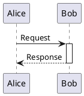
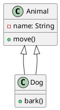
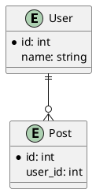
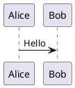
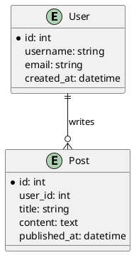
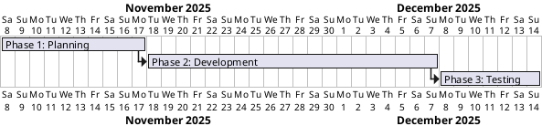

# PlantUML Diagram Generation and Conversion

## Purpose

This skill enables comprehensive PlantUML diagram creation and conversion workflows. PlantUML is a text-based diagramming tool that generates professional diagrams from simple, intuitive syntax. Use this skill to:

1. Create diagrams from natural language descriptions
2. Convert standalone `.puml` files to PNG or SVG images
3. Extract `puml` code blocks from markdown files and convert them to images
4. Replace markdown code blocks with image links automatically

## When to Use This Skill

Use this skill when:
- User requests diagram creation (e.g., "Create a sequence diagram showing authentication flow")
- User needs to convert `.puml` files to images
- User wants to process markdown files containing ```puml code blocks
- User asks for specific diagram types: UML (sequence, class, activity, state, component, deployment, use case, object, timing) or non-UML (ER, Gantt, mindmap, WBS, JSON/YAML, network, Archimate, wireframes)
- User mentions PlantUML explicitly

## Setup Verification

Before creating diagrams, verify the PlantUML setup is complete. Run the setup checker:

```bash
python scripts/check_setup.py
```

This verifies:
- Java installation (required)
- Graphviz installation (recommended for complex layouts)
- plantuml.jar availability

### Quick Setup Guide

If components are missing:

1. **Java**: Download from https://www.oracle.com/java/technologies/downloads/
2. **plantuml.jar**: Download from https://plantuml.com/download
   - Place in: `~/plantuml.jar` or set `PLANTUML_JAR` environment variable
3. **Graphviz** (optional): Download from https://graphviz.org/download/
   - Required for most UML diagrams and complex layouts

## Creating Diagrams

### Process for Diagram Requests

When a user requests a diagram:

1. **Identify the diagram type** based on user intent:
   - **Sequence**: Interactions between objects/actors over time
   - **Class**: System structure with classes and relationships
   - **Activity**: Workflows, processes, decision flows
   - **State**: Object states and transitions
   - **ER (Entity Relationship)**: Database schemas with entities and relationships
   - **Gantt**: Project timelines and task scheduling
   - **MindMap**: Idea organization and brainstorming
   - **Component**: System architecture and modules
   - **Use Case**: Actors and system features
   - **Others**: See `references/toc.md` for all 19 diagram types

2. **Consult references** for syntax:
   - `references/toc.md`: Navigation hub linking to all diagram types
   - `references/[diagram_type].md`: Detailed syntax for specific diagram (e.g., `sequence_diagrams.md`, `class_diagrams.md`)
   - `references/common_format.md`: Universal elements shared across diagrams
   - `references/styling_guide.md`: Modern `<style>` syntax for visual customization
   - `references/plantuml_reference.md`: Comprehensive command-line and troubleshooting guide

3. **Generate the PlantUML source code** following syntax rules:
   - All diagrams start with `@start<type>` (e.g., `@startuml`)
   - All diagrams end with `@end<type>` (e.g., `@enduml`)
   - Use appropriate keywords for the diagram type
   - Add comments with `'` for clarity

4. **Save to `.puml` file** or present to user for review

5. **Convert to image** using the conversion script (see below)

### Syntax Reference Quick Guide

**Common Elements:**
- Comments: `' Single line` or `/' Multi-line '/`
- Relationships: `->` (solid), `-->` (dashed), `..>` (dotted)
- Labels: `A -> B : Label text`
- Styling: Use `skinparam` or `!theme <name>`

**Key Diagram Types:**

**Sequence Diagram:**


**Class Diagram:**


**ER Diagram:**


Consult `references/toc.md` to navigate to specific diagram type guides with comprehensive examples.

## Converting Diagrams

### Convert Standalone .puml Files

Use the `convert_puml.py` script to convert `.puml` files to images:

```bash
# Convert to PNG (default)
python scripts/convert_puml.py diagram.puml

# Convert to SVG
python scripts/convert_puml.py diagram.puml --format svg

# Specify output directory
python scripts/convert_puml.py diagram.puml --format svg --output-dir images/
```

**When to use:**
- User has existing `.puml` files
- User requests image export of created diagrams
- Batch conversion of multiple `.puml` files needed

### Extract and Convert from Markdown

Use the `extract_and_convert_puml.py` script to process markdown files:

```bash
# Extract all ```puml blocks, convert to PNG, and create updated markdown
python scripts/extract_and_convert_puml.py article.md

# Convert to SVG format
python scripts/extract_and_convert_puml.py article.md --format svg

# Custom image directory
python scripts/extract_and_convert_puml.py article.md --output-dir diagrams/
```

**What this script does:**
1. Scans markdown file for all ```puml code blocks
2. Extracts each diagram to a temporary `.puml` file
3. Converts each diagram to PNG or SVG using plantuml.jar
4. Replaces code blocks with image markdown: ``
5. Saves updated markdown as `*_with_images.md`

**When to use:**
- User has markdown with embedded PlantUML diagrams
- User wants to convert documentation to include rendered diagrams
- User needs to generate article versions with images instead of code blocks

**Example markdown input:**
````markdown
# My Article

Here's a sequence diagram:


````

**Output after processing:**
```markdown
# My Article

Here's a sequence diagram:


```

## Direct Command-Line Usage

For advanced users or custom workflows, PlantUML can be invoked directly:

```bash
# Basic PNG conversion
java -jar ~/plantuml.jar diagram.puml

# SVG with custom output
java -jar ~/plantuml.jar --svg --output-dir out/ diagram.puml

# Batch conversion
java -jar ~/plantuml.jar "**/*.puml" --svg

# Pipe input
echo "@startuml Alice->Bob @enduml" | java -jar ~/plantuml.jar -pipe --svg > output.svg
```

See `references/plantuml_reference.md` for comprehensive command-line options.

## Best Practices

### Diagram Quality

- **Use descriptive names**: Generate meaningful filenames from diagram content
- **Add comments**: Use `'` for single-line comments to explain complex logic
- **Follow conventions**: Use standard UML notation for consistency
- **Test incrementally**: Verify simple diagrams before adding complexity

### Format Selection

- **PNG**: Best for web publishing, smaller file sizes, fixed resolution
- **SVG**: Best for documentation, scalable, supports hyperlinks and tooltips
- **Use SVG when**: Diagrams need to be printed or scaled to different sizes

### Styling and Themes

**Modern `<style>` syntax (recommended)**:
```puml
@startuml
<style>
classDiagram {
  class {
    BackgroundColor LightBlue
    BorderColor Navy
    FontColor DarkBlue
  }
  arrow {
    LineColor SeaGreen
  }
}
</style>

' Your diagram content
@enduml
```

See `references/styling_guide.md` for comprehensive modern styling with CSS-like syntax, stereotypes, and advanced techniques.

**Themes** for quick styling:
```puml
@startuml
!theme cerulean
' Your diagram content
@enduml
```

Available themes: `cerulean`, `bluegray`, `plain`, `sketchy`, `amiga`

**Note**: Modern `<style>` syntax is preferred over legacy `skinparam` for better organization and maintainability.

### Error Handling

If diagram generation fails:
1. Check syntax with `java -jar plantuml.jar --check-syntax file.puml`
2. Verify Graphviz installation for UML diagrams
3. Review PlantUML error messages for syntax issues
4. Consult specific diagram guide (see `references/toc.md`) for correct syntax
5. Check `references/common_format.md` for universal elements
6. Review `references/plantuml_reference.md` for troubleshooting

## Workflow Examples

### Example 1: Create and Convert ER Diagram

User request: *"Create an ER diagram for a blog database with Users and Posts"*

1. Generate PlantUML source:


2. Save to `blog_er.puml`

3. Convert to SVG:
```bash
python scripts/convert_puml.py blog_er.puml --format svg
```

### Example 2: Process Markdown with Multiple Diagrams

User request: *"Convert all PlantUML diagrams in my_article.md to images"*

1. Run extraction script:
```bash
python scripts/extract_and_convert_puml.py my_article.md --format png
```

2. Review `my_article_with_images.md`

3. Images saved to `images/` directory

### Example 3: Create Gantt Chart

User request: *"Create a Gantt chart for a 3-phase project"*

1. Generate PlantUML:


2. Save to `project_timeline.puml`

3. Convert to PNG:
```bash
python scripts/convert_puml.py project_timeline.puml --format png
```

## Troubleshooting

### Common Issues

**"plantuml.jar not found"**
- Download from https://plantuml.com/download
- Place in `~/plantuml.jar` or set `PLANTUML_JAR` environment variable
- Verify with: `python scripts/check_setup.py`

**"Graphviz not found"**
- Install from https://graphviz.org/download/
- Add `dot` executable to PATH
- Some diagrams (JSON, YAML, Gantt, MindMap) don't require Graphviz

**"Syntax Error?"**
- Check `@start`/`@end` delimiters match (see `references/common_format.md`)
- Verify diagram-specific keywords
- Consult specific diagram guide from `references/toc.md` for correct syntax

**"Java not found"**
- Install Java JRE/JDK 8+
- Add to PATH
- Verify: `java -version`

## References

Load these files for detailed information:

- **`references/toc.md`**: Navigation hub linking to all 19 diagram types
- **`references/sequence_diagrams.md`**, **`class_diagrams.md`**, **`er_diagrams.md`**, etc.: Comprehensive guides for specific diagram types
- **`references/common_format.md`**: Universal elements shared across all diagram types (delimiters, metadata, comments, notes)
- **`references/styling_guide.md`**: Modern `<style>` syntax with CSS-like rules, stereotypes, and advanced styling
- **`references/plantuml_reference.md`**: Installation, command-line operations, and troubleshooting

## Summary

To use this skill effectively:

1. **Verify setup**: Run `python scripts/check_setup.py`
2. **Navigate diagram types**: Start with `references/toc.md` to find the right diagram type
3. **Learn syntax**: Open specific diagram guides (e.g., `references/sequence_diagrams.md`) for detailed examples
4. **Use modern styling**: Apply `<style>` syntax from `references/styling_guide.md` for professional appearance
5. **Understand universal elements**: Review `references/common_format.md` for shared syntax across diagrams
6. **Convert standalone files**: Use `scripts/convert_puml.py` for `.puml` to image conversion
7. **Process markdown**: Use `scripts/extract_and_convert_puml.py` to extract and convert embedded diagrams
8. **Troubleshoot**: Consult `references/plantuml_reference.md` for installation and CLI help

This skill supports all PlantUML capabilities including UML diagrams (sequence, class, activity, state, component, deployment, use case, object, timing), non-UML diagrams (ER, Gantt, mindmap, WBS, JSON/YAML, network, Archimate, wireframes), modern `<style>` styling, and advanced features (themes, hyperlinks, icons).
